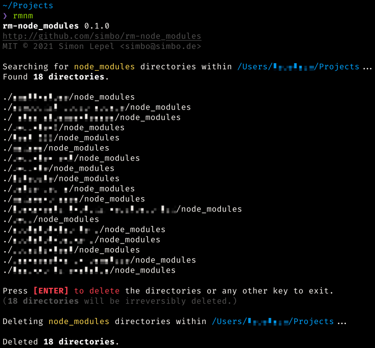
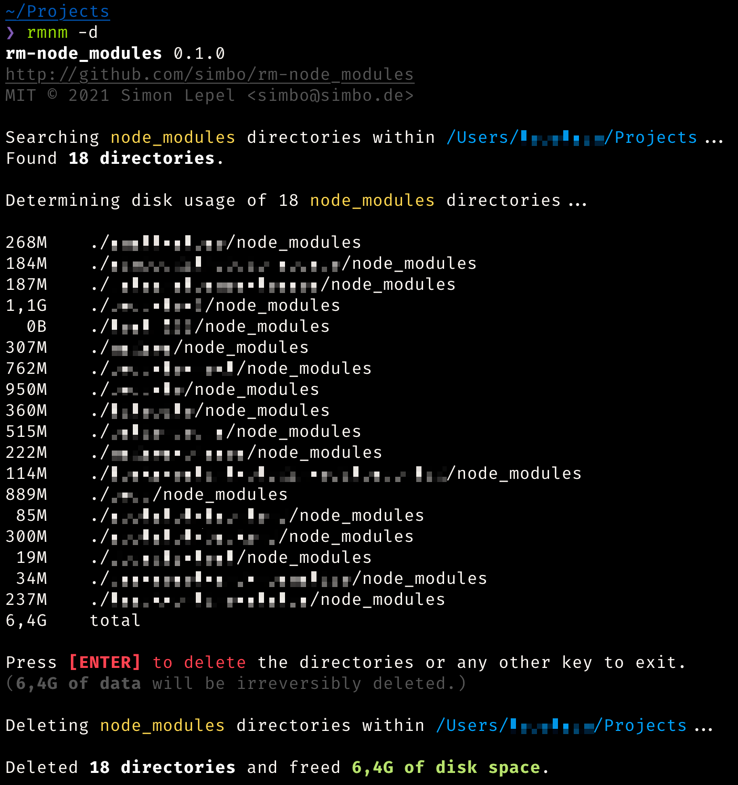

rm-node_modules
===============

> A shell script to find and delete all node_modules directories recursively
> within a given path.

---

## About

Working with node.js projects for some time, your disk space will be filled with
`node_modules` directories taking up quite some space. This script finds them,
lists them and deletes them in a quick and convenient way, while optionally
determining the disk usage of respective directories.

## Requirements

This script should work with every linux or mac platform where bash is available.  
(bash doesn't need to be your default shell.)

If you experience any problems, please [create an issue](https://github.com/simbo/rm-node_modules/issues).

## Install and Update

To install and/or update, simply run the following command:

```sh
curl -o- https://raw.githubusercontent.com/simbo/rm-node_modules/master/install | bash
```

This will install `rm-node_modules` to `$HOME/bin`.

Afterwards, you can run the script using `rm-node_modules` or `rmnm`.

Make sure, it's within your `$PATH`.

### Installing manually

Download [./rm-node_modules](https://raw.githubusercontent.com/simbo/rm-node_modules/master/rm-node_modules)
and put it anywhere you want.

Make it executable: `chmod +x ./rm-node_modules`

And optionally link it with a short alias: `ln -s ./rm-node_modules rmnm`

## Usage

```sh
Usage:  rmnm [-yu] [-d <DIR>]

Options:
  -d <DIR>  directory to search within (default: current directory)
  -y        delete without confirmation
  -u        determine disk usage
  -v        display version info only
```

## Screenshots

### Default Output



### Output with Disk Usage



## License and Author

[MIT &copy; Simon Lepel](http://simbo.mit-license.org/)
