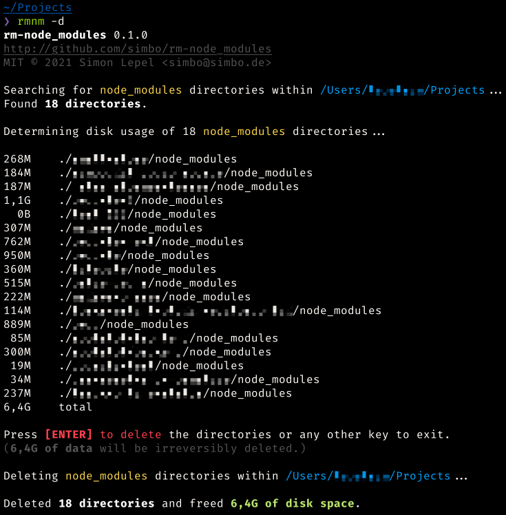

rm-node_modules
===============

> A shell script to find and delete all node_modules directories recursively
> within a given path.

[](https://github.com/simbo/rm-node_modules/releases)
[](https://github.com/simbo/rm-node_modules/actions?query=workflow%3ACI)


---

<!-- TOC anchorMode:github.com -->

- [About](#about)
- [Requirements](#requirements)
- [Install and Update](#install-and-update)
  - [Installing manually](#installing-manually)
- [Usage](#usage)
  - [Examples](#examples)
- [Configure](#configure)
- [FAQ](#faq)
  - [Why not use a Oneliner?](#why-not-use-a-oneliner)
  - [Could you add support for Windows Command Prompt?](#could-you-add-support-for-windows-command-prompt)
- [Screenshots](#screenshots)
  - [Default Output](#default-output)
  - [Output with Disk Usage](#output-with-disk-usage)
- [License and Author](#license-and-author)

<!-- /TOC -->

---

## About

Working with [node.js](https://nodejs.org/) projects for some time, your disk
will be filled with `node_modules` directories taking up quite some space.

*rm-node_modules* finds them, lists them and deletes them in a quick and
convenient way, while optionally determining the potentially freed disk space.

## Requirements

*rm-node_modules* should work with every **Linux** or **Mac** platform where
*bash* is available.  
(Although, bash doesn't have to be your default shell.)

If you experience any problems, please [create an issue](https://github.com/simbo/rm-node_modules/issues).

## Install and Update

To install and/or update the latest version, simply run the following command:

```sh
bash <(curl -so- https://raw.githubusercontent.com/simbo/rm-node_modules/master/install)
```

This will install the latest release of `rm-node_modules` to `$HOME/bin`.

Afterwards, you can run the script using `rm-node_modules` or `rmnm`.

### Installing manually

Download [./rm-node_modules](https://raw.githubusercontent.com/simbo/rm-node_modules/master/rm-node_modules)
and put it anywhere you want.

Make sure, it's within your `$PATH`.

Make it executable: `chmod +x ./rm-node_modules`

And optionally link it with a short alias: `ln -s ./rm-node_modules rmnm`

## Usage

```txt
Usage:  rmnm [-yuv] [-d <DIR> | -c <DIR>]

"Search for node_modules directories within given path and delete them."

Options:
  -d <DIR>  directory to search within
            (default: current directory or configured default directory)
  -y        delete without confirmation
  -u        determine disk usage
  -c <DIR>  configure default directory to search within
  -v        display version info only
```

### Examples

```sh
# run within configured default directory or current working directory
rmnm
# run within current working directory
rmnm -d .
# run with displaying disk usage
rmnm -u
# run with auto-confirming deletion
rmnm -y
# run with auto-confirming deletion and displaying disk usage
rmnm -uy
# run within ~/projects
rmnm -d ~/projects
# run within ~/projects and displaying disk usage
rmnm -u -d ~/projects
# run within ~/projects, display disk usage and auto-confirm deletion
rmnm -uy -d ~/projects
```

## Configure

You can optionally configure a default directory to search for node_modules:

```sh
rmnm -c <DIR>

# for example:
rmnm -c ~/projects
```

If no default directory is configured, the current working directory will be used.

## FAQ

### Why not use a Oneliner?

There are oneliners like the following known in the node.js world, which find
and delete node_modules directories within the current path:

```sh
find . -name "node_modules" -type d -prune -exec rm -rf '{}' +
```

Although, this is a quite simple way to achieve almost the same outcome, there
are some downsides:

  - **You may destroy some of your applications!**  
    Running a command like this in the wrong place, may break some of your apps
    (e.g. vscode plugins, chrome apps or the yarn cache).  
    *rm-node_modules* will warn you, when you are using the script for
    example with your home directory as base directory.

  - **You won't know beforehand what directories are affected!**  
    Again, you might delete or destroy things accidentally.  
    *rm-node_modules* will list affected directories and wait for your
    confirmation before removing them.

### Could you add support for Windows Command Prompt?

**No.**  
Get a real shell for f@#k's sake.

## Screenshots

### Default Output


### Output with Disk Usage



## License and Author

[MIT &copy; Simon Lepel](http://simbo.mit-license.org/)
